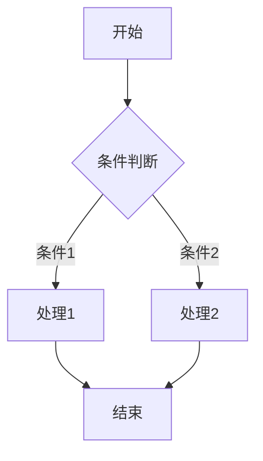
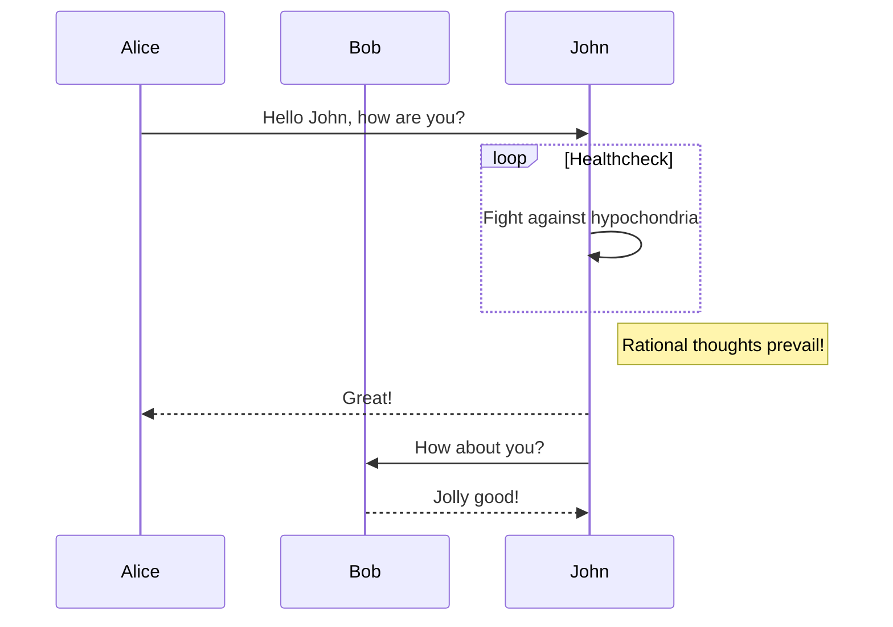

本文仅用于测试 Mermaid 图表在明暗主题下的显示效果。

## 流程图测试

```mermaid
graph TD
    A[开始] --> B{条件判断}
    B -->|条件1| C[处理1]
    B -->|条件2| D[处理2]
    C --> E[结束]
    D --> E
```

## 序列图测试

```mermaid
sequenceDiagram
    participant Alice
    participant Bob
    Alice->>John: Hello John, how are you?
    loop Healthcheck
        John->>John: Fight against hypochondria
    end
    Note right of John: Rational thoughts prevail!
    John-->>Alice: Great!
    John->>Bob: How about you?
    Bob-->>John: Jolly good!
```

## 测试说明

点击页面右上角的主题切换按钮（🌙/☀️）来切换明暗主题，观察 Mermaid 图表的颜色变化。图表应该能够自动适应主题切换，在亮色模式下使用浅色背景和深色文字，在暗色模式下使用深色背景和浅色文字。
